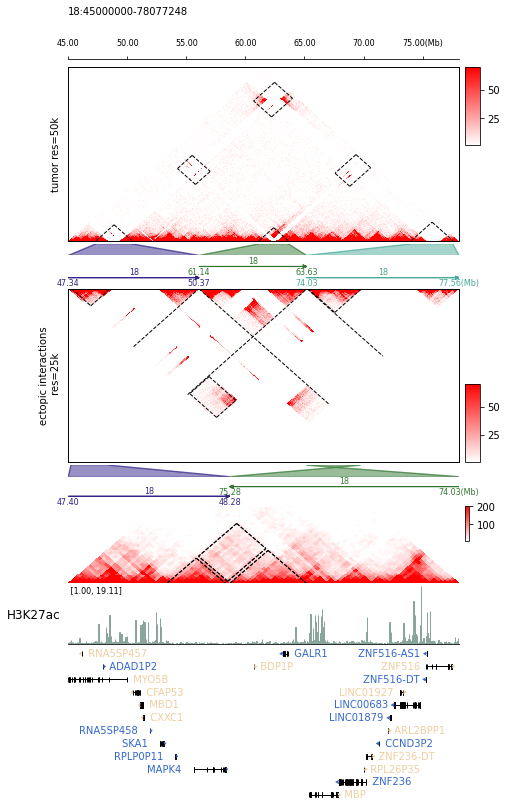

.. image:: https://zenodo.org/badge/572302042.svg
   :target: https://zenodo.org/badge/latestdoi/572302042

=======
trackc
=======

Track view of chromosome conformation and multi-omics data
===========================================================
**trackc** is a python package to flexible visualization of 3D genome and multi-omics data.
It builds on top of `matplotlib`, from which it allow for flexible adjustments.

trackc's key applications
--------------------------
- Mark the abnormal interaction formed by the structural variation of the genome.
- Show the 3Dgenome interaction and multi-omics data after rearrangement.
- Flexible and convenient layout for multi-track 

Available track types
---------------------

.. list-table:: tracks
   :widths: 12 14 15
   :header-rows: 1

   * - track
     - functions
     - Description
   * - Hi-C heatmap
     - tl.extractContactRegions, tl.extractCisContact, mapC
     - support multi-regions and reverse regions
   * - mark regions on heatmap
     - mapc_markline
     - support multi-regions and reverse regions,
       mark square line on mapc heatmap
   * - Virtual4C
     - Virtual4C
     - support multi-regions and reverse regions
   * - bed
     - bed_track
     - support multi-regions and reverse regions,
       styles[bar, line, rectangle, triangle, link]
       to show ChIP-seq peak or ATAC-seq peaks, TAD domains, SVs
       bed or begGraph
   * - bigwig
     - bigwig_track
     - support multi-regions and reverse regions
   * - bedgraph_matrix
     - bdgmat_track
     - support multi-regions and reverse regions,
       styles [heatmap, line] 
   * - zoomin visualization
     - zoomin
     - support multi-regions and reverse regions
   * - gene annotation
     - gene_track
     - support multi-regions and reverse regions
   * - scale bar
     - scale_track
     - genome position scale
   * - multi scale bar
     - multi_scale_track
     - support multi-regions and reverse regions
   * - high light some position or regions
     - vhighlight
     - support multi-regions and reverse regions

Here is an example of du_dynamic_2022 article diagram implemented by trackc.

Installation
============
**PyPI**

Install trackc by running:

.. code-block:: bash

    pip install trackc

**Development version**

To install trackc from GitHub, run::

    pip install git+https://github.com/seqyuan/trackc@main

Usage
======
trackc support both api and cli. Here is a cli example:

.. code-block:: bash

    trackc cli conf.yml

.. image:: neo-domain.png

conf.yml content

.. code-block:: yaml

    trackc:
    - ax: t7
        height: 1.25
        track_type: hicmap
        track_para:
        mat:
            method: extractContactRegions
            clr: ./github/seqyuan/trackc_data/examples/BxPC3.chr18.mcool::/resolutions/25000
            balance: False
            row_regions:
            - 18:47400000-48280000
            - 18:75280000-74030000
        mapC:
            map_type: tri
            label: neo tad
            cmap: PuBu
            height: 40
            ax_on: False
            maxrange: 200
            minrange: 10

    - ax: t8
        height: 0.5
        track_type: bw_track
        track_para:
        bw: ./github/seqyuan/trackc_data/examples/GSM3178671_BxPC3_H3K27ac.bigwig
        regions:
            - 18:47400000-48280000
            - 18:75280000-74030000
        label: H3K27ac
        binsize: 2000
        color:
        - '#5B7695'
    - ax: t6
        height: 0.4
        track_type: multi_scale_track
        track_para:
        regions:
            - 18:47400000-48280000
            - 18:75280000-74030000
        scale_adjust: Mb
        intervals: 2
        tick_fontsize: 7

    - ax: t9
        height: 2.8
        track_type: gene_track
        track_para:
        bed12: ./github/seqyuan/trackc_data/examples/hg19_chr18.gene.bed12
        regions:
            - 18:47400000-48280000
            - 18:75280000-74030000
        line: 12
        gene_fontszie: 8

Documentation
=============
Our documentation provide the full list of possible track types and gallary guidelines for users.

Extensive documentations are available at https://trackc.readthedocs.io

Citation
========
If you use trackc in your analysis, Please cite trackc as follows:

**trackc: a package for flexible visualization of rearrangement 3D genome and multi-omics data**
